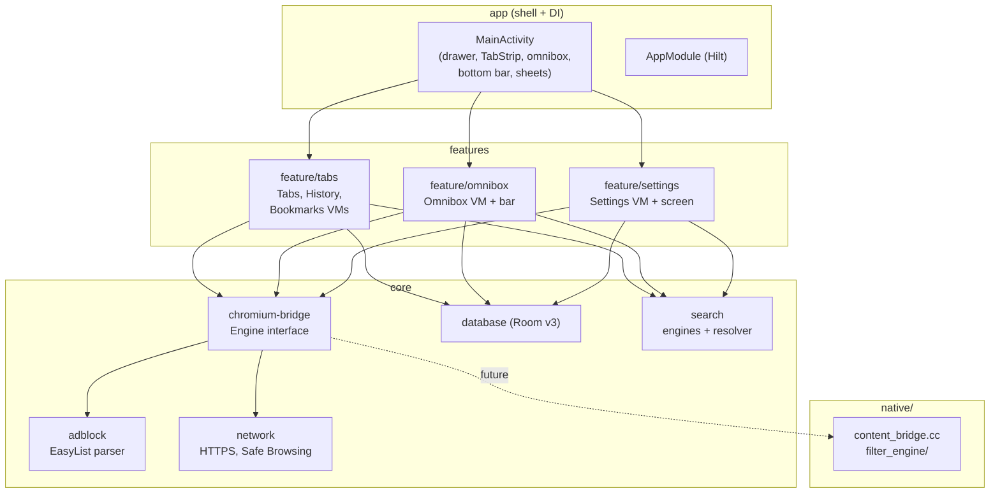

# Logix Browser

<p align="center">
  <strong>Privacy-first, customizable Android web browser built with Kotlin & Jetpack Compose.</strong>
</p>

<p align="center">
  <a href="https://github.com/SolukAtli/logix-browser/blob/master/LICENSE"></a>
  
  
  
  
</p>

<p align="center">
  <a href="#-features">Features</a> •
  <a href="#-screenshots">Screenshots</a> •
  <a href="#-quick-start">Quick Start</a> •
  <a href="#-architecture">Architecture</a> •
  <a href="#-privacy-model">Privacy</a> •
  <a href="#-roadmap">Roadmap</a> •
  <a href="#-contributing">Contributing</a>
</p>

> **Your data stays on your device. Always.**

Logix is a native Android browser with a modern dark UI, built as a clean
multi-module Gradle project. One Compose shell drives everything:
a smart omnibox, a tab strip, five search engines, voice & visual search,
bookmarks, history, powerful theming — and a privacy core with ad/tracker
blocking, incognito isolation and a dead man's switch.

---

## ✨ Features

### Browsing

| Feature | Details |
|---|---|
| Smart omnibox | Auto-detects URL vs. search query, pill UI with engine picker |
| Tab strip | Scrollable tab bar docked to the **top or bottom** (follows bar position) |
| Tab manager | Grid sheet, LRU engine pool, freeze/restore under memory pressure |
| New Tab Page | Minimal LOGIX home with search card + quick actions |
| Voice search | System speech recognizer → fills omnibox and searches |
| Visual search | Pick an image → opens Google Lens |
| Bookmarks | One-tap add/remove, bottom-sheet library |
| History | Auto-logged visits, per-item delete, one-tap clear |
| Pull-to-refresh | Swipe down on any page |
| Page zoom | 80% – 150% text scaling |
| Desktop mode | Per-settings mobile / desktop / Safari user agents |
| Share & copy | Share sheet and clipboard for the current URL |

### Privacy & Security

| Feature | Details |
|---|---|
| Incognito mode | `FLAG_SECURE` (no screenshots), no history/cookies/cache on disk |
| Ad blocking | EasyList-based parser + `DomainTrie`, request-level blocking in WebView |
| Tracker blocking | Analytics / fingerprinting request blocking toggle |
| HTTPS-Only mode | Upgrades navigations to HTTPS |
| Safe Browsing | Pluggable `SafeBrowsingClient` (NoOp by default) |
| Cookie control | Accept / reject cookies globally |
| Quick Clear | One-tap wipe of all history |
| ☠️ Dead Man's Switch | Auto-purges data older than N days (1–365), red danger zone + warning dialog |

### Themes & Customization

- Dark / Light themes (true light scheme, no leftover dark cards)
- **AMOLED mode** — pure black surfaces for OLED screens
- **8 accent presets + custom hex picker** (`#RRGGBB`)
- Bar position: top / bottom (omnibox + tab strip move together)
- Incognito gets its own coal-grey / violet shell

### Search engines

| Engine | Suggest |
|---|---|
| Google | ✅ |
| Bing | ✅ |
| DuckDuckGo | ✅ |
| Yandex | — |
| Brave Search | ✅ |

Custom Canvas brand marks — zero raster assets, crisp at any size.

---

## 📸 Screenshots

> Drop screenshots into `docs/screenshots/` and link them here.

| Home | Browser | Settings |
|---|---|---|
|  |  |  |

---

## 🚀 Quick Start

### Prerequisites

| Tool | Version | Notes |
|---|---|---|
| [Android Studio](https://developer.android.com/studio) | Latest (Narwhal+) | Easiest path |
| JDK | 17+ | AGP 8.13 requires it |
| Android SDK | API 36 (compile / target), min 24 | Installed via Studio |

### Build the APK

```bash
git clone https://github.com/SolukAtli/logix-browser.git
cd logix-browser

# Debug APK (fast, ~20s incremental)
./gradlew :app:assembleDebug
# Output: app/build/outputs/apk/debug/app-debug.apk
```

Install it:

```bash
adb install -r app/build/outputs/apk/debug/app-debug.apk
```

> **Windows note:** if the build can't find Java, set `JAVA_HOME`:
>
> ```powershell
> $env:JAVA_HOME = "C:\Program Files\Eclipse Adoptium\jdk-21.0.12.101-hotspot"
> ```

### Module checks

```bash
./gradlew :core:database:compileDebugKotlin \
          :feature:tabs:compileDebugKotlin \
          :feature:omnibox:compileDebugKotlin \
          :app:compileDebugKotlin
```

### Run tests

```bash
./gradlew testDebugUnitTest
```

---

## 🏗️ Architecture

Single-activity Compose app. `MainActivity` is a thin shell —
all state lives in feature `ViewModel`s, all persistence in Room/DataStore,
all web content behind the `Engine` interface.



### Module map

| Module | Responsibility | Key classes |
|---|---|---|
| `:app` | Compose shell, navigation drawer, Hilt graph, theme | `MainActivity`, `AppModule`, `LogixTheme` |
| `:feature:tabs` | Tabs, history, bookmarks + NTP / bottom bar / sheets UI | `TabsViewModel`, `HistoryViewModel`, `BookmarksViewModel`, `NtpHome`, `TabStripBar` |
| `:feature:omnibox` | Query state, URL resolution, address bar UI | `OmniboxViewModel`, `OmniboxBar`, `EnginePickerSheet` |
| `:feature:settings` | DataStore settings + grouped settings screen | `SettingsViewModel`, `SettingsScreen`, `AccentPalette` |
| `:core:chromium-bridge` | Stable `Engine` API over System WebView today, native Chromium tomorrow | `Engine`, `WebViewEngine`, `ContentViewHost`, `UserAgents` |
| `:core:adblock` | EasyList parsing, domain matching, WebView client hooks | `FilterParser`, `DomainTrie`, `AdBlockWebViewClient` |
| `:core:database` | Room v3: tabs, history, bookmarks, engines, ad stats | `BrowserDatabase`, `BookmarkDao`, `HistoryDao` |
| `:core:network` | HTTPS upgrading, Safe Browsing interface | `HttpsUpgrader`, `SafeBrowsingClient` |
| `:core:search` | Engine catalog + smart URL-vs-query resolver | `DefaultSearchEngines`, `OmniboxResolver` |
| `native/` | JNI bridge + C++ filter engine (experimental) | `content_bridge.cc`, `filter_engine/` |
| `scripts/` | Chromium sync / Trichrome build helpers | `sync-chromium.py`, `build-chromium.sh` |
| `vendor/icons/` | Reference search-engine artwork | SVGs |

### Tech stack

Kotlin 2.1 · Compose BOM 2025.04 (Material3) · Hilt 2.56 · Room 2.6 ·
DataStore Preferences · Coroutines/Flow · KSP · AGP 8.13 · compile/targetSdk 36, minSdk 24.

---

## 🔒 Privacy Model

- **Incognito is real isolation:** history, cookies, cache and form data never
  touch disk; screenshots/screen recording are blocked at the window level.
- **Blocking happens on-device:** filter lists are parsed and matched locally —
  your browsing never leaves the phone for "cloud protection".
- **Death reset is opt-in and loud:** enabling it requires confirming a red
  warning dialog that explains permanent, irreversible deletion.
- **No accounts, no sync servers, no analytics SDKs.**

### Permissions — why each one exists

| Permission | Used for |
|---|---|
| `INTERNET` | Loading web pages (obviously) |
| `RECORD_AUDIO` | Voice search via system speech recognizer |
| `CAMERA` | Visual search capture flow |
| `READ_MEDIA_IMAGES` | Picking an image for visual search |

---

## 🗺️ Roadmap

- [x] Multi-module Kotlin + Compose rewrite
- [x] Tabs, omnibox, 5 engines, voice & Lens search
- [x] Bookmarks + history libraries
- [x] Theming (AMOLED, accents, bar position)
- [x] Ad/tracker blocking, HTTPS-only, dead man's switch
- [ ] Native Chromium embedding via Trichrome (`scripts/`)
- [ ] Extension support
- [ ] Cross-device sync (E2E encrypted)
- [ ] Built-in translator & PDF viewer
- [ ] iOS support

---

## 🤝 Contributing

Contributions are welcome!

1. Fork the repo
2. Create a branch (`git checkout -b feat/amazing`)
3. Commit with [Conventional Commits](https://www.conventionalcommits.org/) (`feat:`, `fix:`, …)
4. Make sure `./gradlew :app:assembleDebug` passes
5. Open a Pull Request

Found a bug? [Open an issue](https://github.com/SolukAtli/logix-browser/issues).

---

## 📄 License

Distributed under the **MIT License**. See [LICENSE](LICENSE) for details.

---

<p align="center"><strong>Built with care for privacy.</strong><br>
<a href="https://github.com/SolukAtli/logix-browser/issues">Report Bug</a> · <a href="https://github.com/SolukAtli/logix-browser/issues">Request Feature</a></p>
